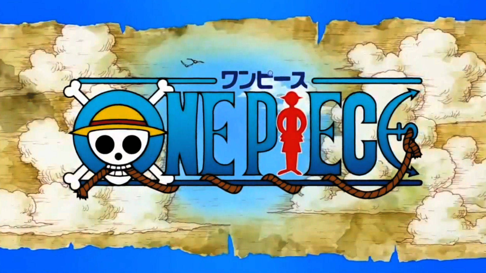
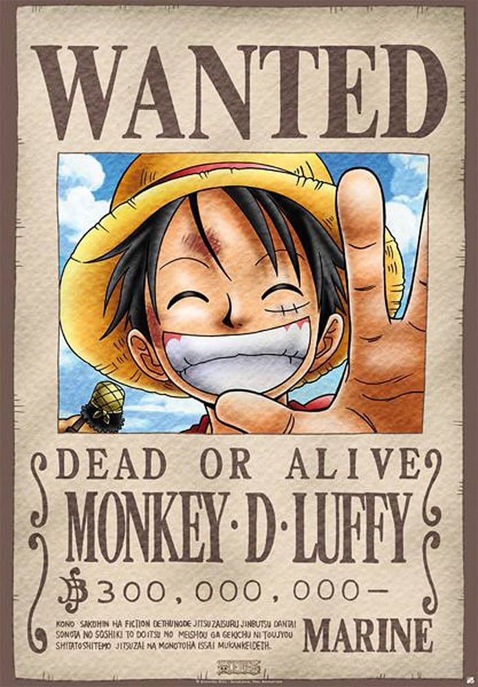
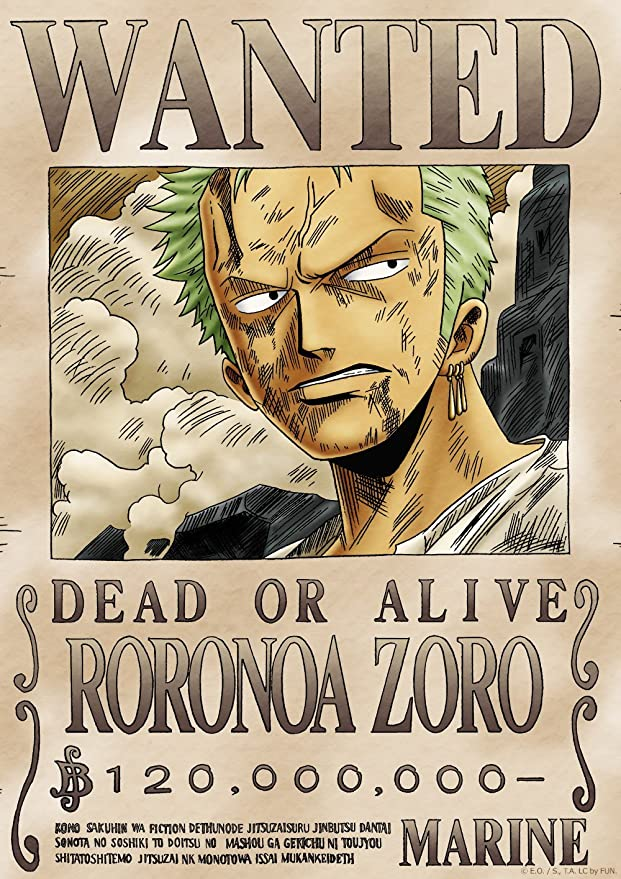
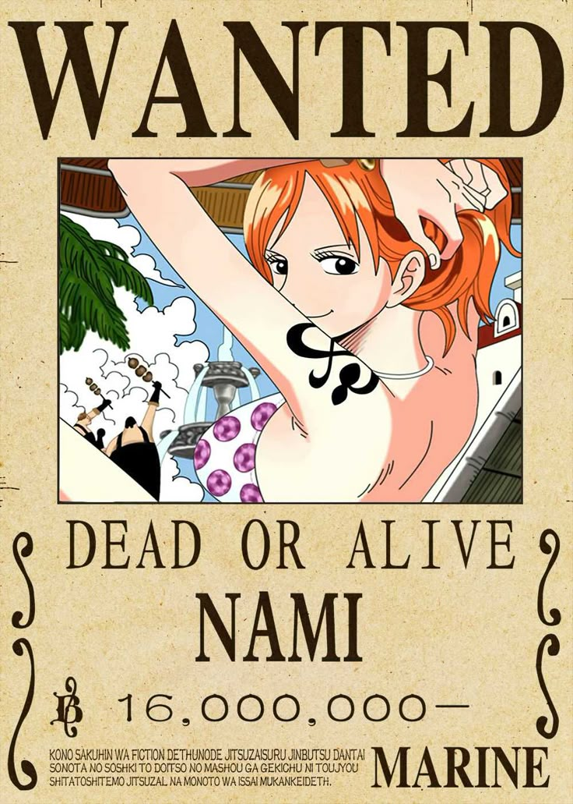

# 🌊 One Piece: Más que un Anime — Un Reflejo del Mundo Real

**Autor:** Alvaro Escalona Comesaña  
**Tema:** El paralelismo entre *One Piece* y los conflictos del mundo moderno.  

# 1. Los Personajes de *One Piece* y lo que Representan

La grandeza de *One Piece* no solo radica en su historia o en su mundo, sino en la **profundidad humana y simbólica de sus personajes**.  
Eiichiro Oda ha construido una tripulación diversa, compleja y emocionalmente coherente, donde cada integrante del *Sombrero de Paja* encarna un valor, una lucha y una visión del mundo.  
Cada uno de ellos representa **una faceta de la condición humana** y **un ideal universal**.

---

## 🧢 Monkey D. Luffy — La Libertad Absoluta      

Luffy no busca poder ni fama; su sueño de ser el **Rey de los Piratas** simboliza la **libertad total**.       
Representa la pureza del espíritu humano que no se doblega ante las reglas injustas del sistema.

> “Ser el Rey de los Piratas significa ser el más libre del mar.”                                  

- **Valor simbólico:** Libertad, autenticidad y esperanza.  
- **Evolución:** De un joven impulsivo a un líder que inspira a todos a perseguir sus sueños sin miedo.  
- **Paralelismo humano:** La lucha individual por la independencia frente a la sociedad y sus estructuras.

---

## ⚔️ Roronoa Zoro — La Determinación y el Honor      

Zoro vive por su promesa: ser el **mejor espadachín del mundo**.  
Su historia representa la **disciplina, el sacrificio y la lealtad** absoluta hacia sus principios y hacia Luffy.

- **Valor simbólico:** Voluntad inquebrantable y sentido del honor.  
- **Evolución:** De un cazador solitario a un pilar moral y protector de la tripulación.  
- **Paralelismo humano:** La lucha por superarse y mantener la integridad incluso ante la derrota.

---

## 🍊 Nami — El Dolor, la Inteligencia y la Redención  

Nami simboliza la **resiliencia ante la opresión**.  
Su historia con Arlong es una de las más emocionales del anime: una niña que pierde todo, pero usa su inteligencia para recuperar su libertad y la de su pueblo.

- **Valor simbólico:** Superación, independencia y redención.  
- **Evolución:** De una ladrona desconfiada a una estratega leal.  
- **Paralelismo humano:** Las víctimas de abuso o control que logran reconstruirse y recuperar su poder personal.

---

## 🔥 Sanji — La Nobleza y la Dignidad

Sanji representa la **caballerosidad, la empatía y el respeto hacia los demás**, incluso en un mundo cruel.  
Su historia en el Baratie y su pasado con los Vinsmoke reflejan la lucha por **mantener la bondad en un entorno corrupto**.

- **Valor simbólico:** Dignidad, altruismo y respeto.  
- **Evolución:** De cocinero rebelde a protector paternal de la tripulación.  
- **Paralelismo humano:** Las personas que eligen la compasión sobre la violencia o el egoísmo.

---

## 🧠 Nico Robin — El Conocimiento y la Verdad

Robin es una arqueóloga perseguida por buscar **la verdad sobre la historia prohibida**.  
Encarna la **búsqueda del conocimiento en un mundo que teme la verdad**.

> “Quiero vivir.”

- **Valor simbólico:** Sabiduría, memoria y resistencia intelectual.  
- **Evolución:** De una mujer que teme vivir, a una que elige hacerlo rodeada de amor y confianza.  
- **Paralelismo humano:** Los intelectuales, periodistas o científicos que arriesgan su vida por exponer la verdad.

---

## 🦌 Tony Tony Chopper — La Inocencia y la Aceptación

Chopper es un reno que comió la Fruta del Diablo y fue rechazado por su especie y los humanos.  
Representa **la búsqueda de identidad y aceptación**, y el deseo de ayudar a los demás.

- **Valor simbólico:** Inocencia, empatía y autoconfianza.  
- **Evolución:** De un ser rechazado a un médico que salva vidas.  
- **Paralelismo humano:** Aquellos que son diferentes o marginados, pero encuentran su valor en la bondad y la ciencia.

---

## 🏹 Usopp — La Mentira y el Coraje

Usopp es el más humano del grupo: **miente por miedo, pero actúa con valentía cuando importa**.  
Su evolución es una metáfora del **proceso de madurar y enfrentar los miedos**.

- **Valor simbólico:** Valentía, crecimiento y fe en uno mismo.  
- **Evolución:** De un soñador cobarde a un héroe que inspira a otros.  
- **Paralelismo humano:** Representa a todos los que dudan, pero siguen adelante a pesar del miedo.

---

## ⚙️ Franky — La Creatividad y la Superación

Franky simboliza **la autosuperación y la libertad creativa**.  
Su cuerpo modificado refleja cómo las cicatrices —físicas o emocionales— pueden transformarse en fuerza y arte.

- **Valor simbólico:** Innovación, reconstrucción y libertad de ser uno mismo.  
- **Evolución:** De un delincuente a un ingeniero que construye sueños.  
- **Paralelismo humano:** Las personas que reinventan su vida tras el dolor.

---

## 🎸 Brook — La Muerte, la Soledad y el Legado

Brook es un esqueleto vivo que perdió a su tripulación, pero mantuvo su alma.  
Representa **la inmortalidad del espíritu, la música y la memoria**.

> “Yo ya morí una vez, así que no le temo a nada.”

- **Valor simbólico:** Esperanza eterna y el poder del arte.  
- **Evolución:** De un alma solitaria a un símbolo de alegría y nostalgia.  
- **Paralelismo humano:** La conexión emocional entre la vida, la muerte y los recuerdos.

---

## 🐋 Jinbe — La Paz y la Igualdad

Jinbe es el símbolo de **la reconciliación y la coexistencia** entre especies y pueblos.  
Su papel como antiguo enemigo y actual aliado representa **la madurez política y moral**.

- **Valor simbólico:** Justicia, empatía y liderazgo pacífico.  
- **Evolución:** De guerrero nacionalista a diplomático global.  
- **Paralelismo humano:** Los líderes que luchan por la igualdad y el entendimiento entre culturas.

---

## 🌈 Conclusión: La Tripulación como Metáfora del Ser Humano

Cada miembro de los *Sombreros de Paja* representa **una parte esencial del alma humana**:  
la libertad (Luffy), la voluntad (Zoro), la inteligencia (Nami), la nobleza (Sanji), la verdad (Robin), la inocencia (Chopper), el valor (Usopp), la creatividad (Franky), el alma (Brook) y la paz (Jinbe).

Juntos forman **una alegoría completa de la humanidad**: imperfecta, diversa, emocional y soñadora, unida bajo un mismo ideal — *la libertad*.

> 🏴‍☠️ “No importa quién seas o de dónde vengas; si tienes un sueño, el mar es tuyo.”
